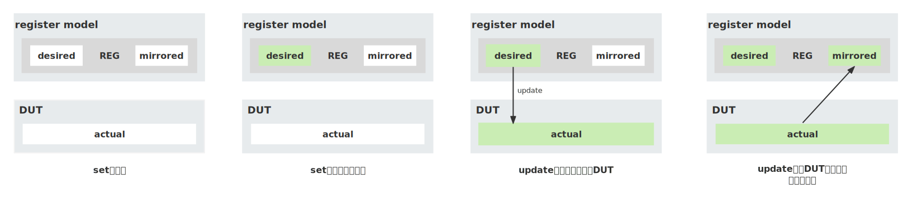

# UVM寄存器模型实践

# 1. UVM寄存器模型基本概念

## 1.1 什么是UVM寄存器模型

UVM寄存器模型（UVM register model）是UVM提供的一组高级抽象的类，用来对DUT中具有地址映射的寄存器（register）和存储器（memory）进行建模。UVM寄存器模型在验证环境（testbench）中“复刻”DUT的寄存器，简化验证环境对寄存器的访问流程。


## 1.2 为什么需要UVM寄存器模型

UVM寄存器模型出现之前，如果想在验证环境中读/写DUT的某个寄存器，需要调用读/写总线的sequence，同时给出目标寄存器地址。driver收到transaction后，驱动信号线对DUT的寄存器进行读/写。这一过程不仅**繁琐**而且有很多**局限性**，配置寄存器只能通过总线，无法在测试过程中随意修改寄存器的值来构造特定验证场景。

UVM寄存器模型的出现弥补了上述缺陷，使用寄存器模型内置的read/write等方法能够轻松地访问寄存器，通过后门访问的方式可以绕过总线来获取/配置寄存器的值（没有仿真时间的消耗）。同时，UVM寄存器模型内建的自动测试sequence可以在项目初期快速完成寄存器基本功能的检验。

## 1.3 UVM寄存器模型概览

我们知道一个寄存器由多个位域构成，单个位域包含多个比特位，一个功能模块中的多个寄存器组团构成一个寄存器模型。为了与硬件寄存器保持一致，UVM抽象出了一系列寄存器相关的类，以此来搭建层次化的寄存器模型。寄存器模型的最小单位是位域（uvm_reg_field），一个寄存器（uvm_reg）可以包含多个位域。而单个模块的所有寄存器和存储器（uvm_mem）都包含在一个寄存器块（uvm_reg_block）中。

| 类名 | 说明 |
| --- | --- |
| uvm_reg_field | 用来针对寄存器功能来构建对应的比特位 |
| uvm_reg | 与寄存器相匹配，其内部可以例化和配置多个uvm_reg_field对象 |
| uvm_mem | 匹配硬件存储模型 |
| uvm_reg_map | 用来指定寄存器列表中各个寄存器的偏移地址、访问属性以及对应的总线 |
| uvm_reg_block | 可以容纳多个寄存器（uvm_reg）、存储器（uvm_mem）和寄存器列表（uvm_reg_map） |

# 2. UVM寄存器模型的生成

当我们在建立寄存器模型时，如何与硬件寄存器的内容和属性保持一致呢？这个时候就需要一份**中心化管理**的**寄存器描述文件**，我们推荐使用Excel文件保存寄存器描述。为什么寄存器描述应该被中心化管理？因为，当设计和验证人员都将寄存器描述文档作为唯一的功能实现和测试方案的参考时，在项目过程中能降低双方出现分歧和错误的可能。

在确定寄存器描述文件后，有两种方法实现寄存器模型，手写或者借助脚本工具。一个硬件模块的寄存器数量少则几十多则上百，如果纯靠手写不仅浪费时间而且容易出错。为此，我们开发了一个寄存器描述文件转换脚本——***excel2ralf***，该脚本能将Excel文件转换为RALF文件。再借助VCS提供的ralgen工具，把RALF文件转换成SV文件，这样就得到了我们需要的UVM寄存器模型。


## 2.1 寄存器Excel文件格式


上面是寄存器Excel文件示意图，需要填入的信息有十项，它们所表示的含义和注意事项如下：

- BaseAddress：绝对地址，指明该模块在系统中的绝对地址。生成模块级寄存器模型时不关心，但是在生成系统级寄存器模型时会影响地址映射。地址以“***0x***”开头，十六进制，大小写不敏感
- Type：类型，指明当前这一行描述的是寄存器（register）还是存储器（memory）。只支持填入“***reg***”和“***mem***”
- OffsetAddress：偏移地址，指明寄存器或存储器在当前模块内的偏移，生成寄存器模型时会影响地址映射。地址以“***0x***”开头，十六进制，大小写不敏感
- RegName：寄存器名，指明当前寄存器（或存储器）的名字，需要跟RTL代码中对应寄存器（存储器）名字**保持一致**，**大小写敏感**
- Width：位宽，指明寄存器的宽度。如果当前是寄存器数组或存储器，则需要使用*”***位宽*长度***”*的方式表示
- Bits：比特数，指明当前位域占用寄存器的第几比特到第几比特，格式为“**[*start_bit:end_bit*]**”。如果只有一位也可以写成“**[*start_bit*]**”
- fieldName：位域名，指明当前位域的名字。如果当前是保留位域，固定填“***reserved***”。如果当前行是存储器，则可以填“NA”或不填
- Access：访问类型，指明当前位域（或存储器）的访问类型。对于普通寄存器位域支持以下类型“***rw|ro|wo|w1|w1c|rc|rs|wrc|wrs|wc|ws|wsrc|wcrs|w1s|w1t|w0c|w0s|...***“，完整访问类型信息见附录1。对于存储器类型只支持两种访问类型，”***rw***“和”***ro***“，分别对应于RAM和ROM
- ResetValue：复位值，指明硬件复位后位域的值。复位值支持两种表示形式：“***x’bx***”和“***x'hx***”。如果当前行是存储器，则可以填“NA”或不填
- Description：描述信息，说明当前位域的功能和注意事项

## 2.2 excel2ralf脚本使用方法

excel2ralf脚本基于***Python3.6***开发，支持把指定寄存器Excel文件转换为RALF文件，同时可以指定RALF文件的输出路径。使用时可根据项目需要选择生成“模块级”和“系统级”的RALF文件。

```bash
usage: excel2ralf [-h] [-s] [-f FILE] [-d DIR] [-o OUTPUT]

transform register Excel file to RALF file

optional arguments:
  -h, --help                    show this help message and exit
  -s                            generate ralf file in system level
  -f FILE, --file FILE          specify a register Excel file to be transformed
  -d DIR, --directory DIR       specify a directory which contents register Excel files
  -o OUTPUT, --output OUTPUT    the output path of the transformed ralf file
```

excel2ralf支持以下选项：

- -h, --help：打印excel2ralf脚本帮助信息
- -s：生成“系统级”RALF文件，与”-d”选项配合使用
- -f FIlE, --file FILE：指定待转换的Excel文件。生成“模块级”RALF文件时，即不使用”-s”选项，必须指定该选项；生成“系统级”RALF文件时无需指定
- -d DIR, --directory DIR：指定一个目录，excel2ralf脚本会自动读取该目录下所有Excel文件，最终转换成“系统级”RALF文件，与“-s”选项配合使用
- -o OUTPUT, --output OUTPUT：指定RALF文件输出目录，默认为当前脚本执行的目录

应用示例：

```bash
"模块级转换"
excel2ralf -f .\example\temp_module_reg_spec.xlsx -o .\ralf

"系统级转换"
excel2ralf -s -d .\example -o .\ralf
```

## 2.3 ralgen工具使用方法

下面截取了一段RALF代码：

```c
register Rx_FIFO {
	field Rx_Data {
		bits 8;
		access ro;
		reset 8'b0;
	}
	field reserved {
		bits 24;
	}
}

register Tx_FIFO {
	field Tx_Data {
		bits 8;
		access wo;
		reset 8'b0;
	}
	field reserved {
		bits 24;
	}
}

...

block temp {
  bytes 4;
	register Rx_FIFO (Rx_FIFO) @'h00;
	register Tx_FIFO (Tx_FIFO) @'h04;
	register STAT_REG (STAT_REG) @'h08;
	register CTRL_REG (CTRL_REG) @'h0c;
	register R_ARRAY[256] (R_ARRAY[%d]) @'h10;
	memory RAM (RAM) @'h100;
}
```

RALF代码具有层次性，即block中包含register/register array/memory，register中包含field。其实，不管是Excel，还是RALF，亦或是最终的寄存器模型，都是在用不同方式表示层次化的寄存器。

生成RALF文件后，离最终的寄存器模型还有一定距离。使用Synopsys VCS自带的ralgen工具，能够将RALF文件转换成最终的寄存器模型，下面让我们看一下它的使用方法：

```bash
% ralgen [options] -t topname -I dir -uvm {filename.ralf}
```

必要选项：

- -t topname：指定RALF文件中一个top_level的register block或者system的名称
- -I dir：指定ralgen搜索引用文件的路径
- -uvm：指定生成UVM寄存模型
- filename.ralf：指定ralgen需要转换的RALF文件

可选选项：

ralgen支持许多功能丰富的可选选项，在应用时可根据自身需求添加，详细内容见附录2。

应用示例：

```bash
ralgen -t temp -I . -uvm ral_temp.ralf
```

# 3. UVM寄存器模型的应用

## 3.1 UVM寄存器模型集成

在物理世界中对真实硬件模块进行读/写操作时，通常需要在**总线**上完成数据交互。因此，我们在验证环境中引入总线VIP（Verification IP）来模拟总线传输。一次总线传输往往需要考虑给出地址、数据、访问方式等，对于测试平台搭建者来说并不友好。UVM寄存器模型的加入，简化了验证环境与总线VIP之间的交互。寄存器模型类似中间机构，接收验证环境对寄存器的访问请求后，将请求转换成总线transaction，并通过总线VIP的sequencer发送给driver，最终驱动物理信号完成传输。如何将寄存器模型和总线VIP同时集成到验证环境中是接下来要介绍的内容。

下面是**UVM寄存器模型与总线VIP集成示意图**，图上除了我们熟悉的Register Model（寄存器模型），Bus Agent（总线VIP）和DUT（待测设计）之外，有两个模块需要重点关注：***adapter***（桥接器）和***predictor***（预测器）。


### 3.1.1 adapter

UVM寄存器模型收到验证环境对寄存器的访问请求后会生成寄存器transaction，寄存器transaction需要转换成总线transaction（uvm_sequence_item）后才能被识别和使用。因此，adapter的主要功能是完成寄存器transaction和总线transaction之间的相互转换。

一般情况下，总线VIP会提供其相对应的adapter。如果VIP没有提供，则需要我们手动实现。在实现adapter时要注意从***uvm_reg_adapter***类中派生自定义adapter。寄存器transaction在寄存器模型中被实现为结构体***uvm_reg_bus_op***，uvm_reg_bus_op包含6个成员变量，用来描述总线传输所需信息。

| 成员变量 | 类型 | 说明 |
| --- | --- | --- |
| addr | uvm_reg_addr_t | 寄存器地址，默认为64bit |
| data | uvm_reg_data_t | 读/写数据，默认为64bit |
| kind | uvm_access_e | 访问方式，枚举类型，分别为UVM_READ和UVM_WRITE |
| n_bits | unsigned int | 本次传输的比特数 |
| byte_en | uvm_reg_byte_en_t | 支持byte操作 |
| status | uvm_status_e | 传输状态，枚举类型，分别为UVM_IS_OK，UVM_IS_X和UVM_NOT_OK |

uvm_reg_adapter提供了两个成员函数***reg2bus()***和***bus2reg()***，用来将uvm_reg_bus_op的成员变量映射到总线transaction，或从总线transaction映射到uvm_reg_bus_op。在实现adapter时需要在uvm_reg_adapter的子类中重写这两个函数。uvm_reg_adapter还提供了两个成员变量***supports_byte_enable***和***provides_responses***，可根据所使用的总线的功能进行相应配置。

| 成员函数 | 说明 |
| --- | --- |
| reg2bus | 将uvm_reg_bus_op转换成目标总线transaction |
| bus2reg | 将目标总线transaction转换成uvm_reg_bus_op |

| 成员变量 | 说明 |
| --- | --- |
| supports_byte_enable | 0：总线不支持byte访问，1：总线支持byte访问 |
| provides_responses | 0：总线不返回response数据，1：总线返回response数据 |

### 3.1.2 predictor

UVM寄存器模型不仅能提供寄存器访问方法，也能持续追踪DUT寄存器的值。在一次总线传输过后，寄存器模型通过prediction机制更新其内部数据。UVM提供了两种prediction模式，它们分别是**自动预测**（Auto Prediction）和**显式预测**（Explicit Prediction）

**自动预测**

自动预测是最简单的预测机制。在该模式下，不论使用何种访问方式寄存器（读或写），都会在总线周期的最后自动调用predict()函数，完成UVM寄存器模型更新。


自动预测**依赖于**寄存器模型驱动总线sequence，只有在总线sequence执行时才能更新寄存器模型。如果其他非总线sequence通过目标总线sequencer的传输完成了寄存器的更新，又或者直接通过DUT interface更新寄存器，都无法通过自动预测更新寄存器模型。UVM寄存器模型默认使用显式预测（Explicit Prediction），如果想使用自动预测，需要调用***set_auto_predict()***函数。

```verilog
class my_test extends uvm_test;
	...
	reg_model rm;
	...
	function void build_phase(uvm_phase phase);
		...
		rm = reg_model::type_id::create("my_reg_model");
		rm.build();
		***rm.map.set_auto_predict();***
		...
	endfunction
endclass
```

**显式预测**

与自动预测不同，显式预测引入额外的***predictor***组件监听目标总线。predictor捕捉到总线transaction后，通过adapter将总线transaction转换成寄存器transaction（uvm_reg_bus_op），接着使用addr（uvm_reg_bus_op成员变量）查找被访问的寄存器，最后调用predict()函数更新。


显式预测的主要优点是，只要总线上发生寄存器访问，就能将DUT的变化更新到寄存器模型。需要注意的是，predictor组件更新寄存器模型时，会忽略读/写方法返回的状态值（status）。如果某次访问返回了错误（UVM_NOT_OK）状态，为了不让寄存器模型更新需要过滤掉本次访问信息。过滤的操作可以在总线monitor或predictor组件内完成。

使用显式预测前，需要把***adapter***和**寄存器模型*map*的句柄**传给predictor，同时将总线***monitor***的***analysis port***接入predictor。predictor所需的组件和连接方式如下图所示，具体实现方法后续章节会详细介绍。


### 3.1.3 寄存器模型集成步骤

**Step1: 寄存器模型例化和传递**

在使用寄存器模型时倾向于**顶层传递**的方式，即在test层例化寄存器模型后，再通过***uvm_config_db***传给下层模块。这种方法有利于验证环境env的闭合性（我的理解是，将bus agent和register model隔离开，如果某条testcase需要对reg model做不同的配置，那么可以在test层中完成配置，不用修改env的代码）。例化后我们需要**手动调用**寄存器模型的***build()***函数，因为uvm_reg_block继承自uvm_object，不支持phase机制，所以其预定义的build()函数不会自动执行。

```verilog
class my_test extends uvm_test;
	...
	reg_model rm;
	...
	function void build_phase(uvm_phase phase);
		...
    ***uvm_reg::include_coverage("*", UVM_CVR_ALL);***
		***rm = reg_model::type_id::create("my_reg_model");*
		*rm.build();***
		...
		***uvm_config_db#(reg_model)::set(this, "", "rm", rm);***
	endfunction
endclass

class my_env extends uvm_env;
	...
	reg_model rm;
	...
	function void build_phase(uvm_phase phase);
		...
		if (!***uvm_config_db#(reg_model)::get(this, "", "rm", rm)***) begin
			...
		end
	endfunction
endclass
```

**Step2: 连接寄存器模型map，总线sequencer和adapter**

在env层的connect_phase中，将寄存器模型的***map***组件与总线的***sequencer***和***adapter***连接起来。这一步的必要性在于将上述三者关联在一起，只有这样adapter才能正常工作。

```verilog
class my_env extends uvm_env;
	...
	reg_model   rm;
	bus_agent   bus_agt;
	bus_adapter adapter;
	...
	function void connect_phase(uvm_phase phase);
		...
		***rm.map.set_sequencer(bus_agt.sequencer, adapter);***
	endfunction
endclass
```

**Step3: 配置uvm_reg_predictor组件**

寄存器模型默认使用**显式预测**（explicit prediction）模式（同时也是推荐模式）。显式预测需要用到uvm_reg_predictor组件，它是参数化的类，在声明时需要使用总线transaction。在配置uvm_reg_predictor时有以下几个关键点需要注意：

1. 声明predictor时，使用总线的sequence_item（transaction）作为类的指定参数
2. 在build_phase中创建predictor
3. 在connect_phase中完成以下操作：
    1. 将predictor的map组件设置为register model的map
    2. 将predictor的adapter设为总线的adapter
    3. 将predictor的analysis export连接到总线agent的analysis port上

```verilog
class my_env extends uvm_env;
	...
	***uvm_reg_predictor #(bus_seq_item) predictor;***
	...
	function void build_phase(uvm_phase phase);
		...
		***predictor = uvm_reg_predictor #(bus_seq_item)::type_id::create("predictor", this);***
		...
	end

	function void connect_phase(uvm_phase phase);
		...
		***predictor.map = rm.map;***
		***predictor.adapter = adapter;***
		***bus_agt.ap.connect(predictor.bus_in);***
		...
	endfunction
endclass
```

**Step 4: 配置寄存器模型对象**

根据不同项目的需求，通常会对实例化出来的寄存器模型句柄进行不同的配置，如：配置后门访问的路径，初始复位寄存器模型等等。下面介绍一些常用的寄存器模型配置函数，**带红色星号的函数是必须调用的函数**。以下操作都在test层的build_phase中执行。

1. configure(parent, hdl_path)*****
    
    configure()函数可以配置寄存器模型后门访问的路径，如果当前寄存器模型是最顶层的uvm_reg_block，parent参数填null即可
    
2. lock_model()*****
    
    寄存器模型在使用前必须要调用lock_model()，因为lock_model()会完成地址的映射，同时不允许寄存器模型再进行修改，如添加register和memory等
    
3. reset()*****
    
    复位寄存器模型中所有寄存器的值。如果不调用此函数，寄存器模型中所有寄存器的值都是0；调用此函数后，所有寄存器的值都将变为设置的复位值
    
4. set_coverage()
    
    开启寄存器模型覆盖率收集功能，可以指定功能覆盖率类型，具体类型详见“UVM寄存器模型覆盖率收集”章节
    

示例代码：

```verilog
class my_test extends uvm_test;
	...
	function void build_phase(uvm_phase phase);
		...
		***rm.configure(null, "top.dut");***
		rm.build();
		***rm.lock_model();***
		***rm.reset();
    rm.set_coverage(UVM_CVR_ALL);***
		...
	endfunction
endclas
```

**注意事项：**

1. ralgen生成的寄存器模型中使用了build_coverage()函数，为了避免仿真时大量打印下面的提示信息，创建寄存器模型之前要加上***uvm_reg::include_coverage("*", UVM_CVR_ALL);***
    
    ```bash
    include_coverage not located
      did you mean xxx?
    ```
    
2. 在对field进行读写时如果报出下面的warning：
    
    ```verilog
    UVM_WARNING xxx reporter [RegModel] Individual xxx field access not available for field 'xxx'. Access complete register instead.
    ```
    
    在编译时加入***+define+UVM_REG_NO_INDIVIDUAL_FIELD_ACCESS***可以去掉warning
    

## 3.2 UVM寄存器访问方法

UVM寄存器模型建立好后，可以在任意component中使用，只需要在component中定义一个寄存器模型的句柄，并将例化后的寄存器模型赋值给该句柄即可。

UVM寄存器模型提供两种寄存器访问方式，**前门访问**（front-door）和**后门访问**（back-door）。前门访问模拟真实硬件访问流程，严格遵守总线协议，由总线VIP实现总线的物理时序访问，因此每次访问都消耗仿真时间。后门访问则绕过了总线VIP，利用UVM DPI（uvm_hdl_read()，uvm_hdl_desposit()）将寄存器操作直接作用到DUT内的寄存器变量，不消耗仿真时间而只消耗运行时间。

### 3.2.1 前门访问

前门访问通常使用寄存器模型提供的两个基本任务：read和write。read/write任务可传入参数较多，我们以read为例，介绍一下如何在验证环境中调用read/write任务。

```verilog
virtual task read(
  output uvm_status_e       status,
  output uvm_reg_data_t     value,
   input uvm_path_e         path       = UVM_DEFAULT_PATH,
   input uvm_reg_map        map        = null,
   input uvm_sequence_base  parent     = null,
   input int                prior      = -1,
   input uvm_object         extension  = null,
   input string             fname      = "",
   input int                lineno     = 0
)
```

调用时，除了***status***和***value***两个参数需要传入，其他参数可以不指定，直接使用默认值。前门访问时，要注意将path指定为***UVM_FRONTDOOR***。

应用示例：

```verilog
class my_driver extends uvm_driver;
  ...
  reg_model rm;
  ...
  ***uvm_status_e status;***
  ***uvm_reg_data_t data;***
  ***rm.CTRL_REG.read(status, data, UVM_FRONTDOOR);***
  ...
endclass
```

### 3.2.2 后门访问

进行后门访问前，要确保寄存器模型在建立时已将各个寄存器映射到DUT侧的HDL路径。我们通过脚本生成的寄存器模型已经在内部调用了uvm_reg::add_hdl_path()函数，完成了每个寄存器相对于寄存器模型的HDL路径映射。因此，在使用寄存器模型前，只需在configure()函数中指定DUT相对于验证环境顶层的路径即可。

read和write任务不仅可以用于前门访问，也可以用于后门访问，区别是调用时要将path参数指定为***UVM_BACKDOOR***。针对后门访问，寄存器模型额外提供了一组任务：***peek***（读取）和***poke***（修改）。既然read和write能用于后门访问，为什么UVM还要额外提供peek和poke呢？因为这两类任务在操作寄存器时的行为有区别：

- read/write在后门访问时会模拟DUT的行为操作寄存器，即读取RC（clear-on-read）类型的寄存器后，该寄存器会被清零；对于RO（read-only）类型的寄存器则无法写入。
- peek/poke完全不管DUT的行为，直接操作寄存器。
    
    ```verilog
    virtual task peek(
      output uvm_status_e      status,
      output uvm_reg_data_t    value,
       input string            kind      = "",
       input uvm_sequence_base parent    = null,
       input uvm_object        extension = null,
       input string            fname     = "",
       input int               lineno    = 0
    )
    ```
    

应用示例：

```verilog
class my_driver extends uvm_driver;
  ...
  reg_model rm;
  ...
  uvm_status_e status;
  uvm_reg_data_t data;
  ***rm.CTRL_REG.write(status, 'h22, UVM_BACKDOOR);
  rm.CTRL_REG.read(status, data, UVM_FRONTDOOR);
  rm.CTRL_REG.write(status, 'h11, UVM_FRONTDOOR);
	rm.CTRL_REG.peek(status, data);***
  ...
endclass
```

### 3.2.3 前后门访问对比

| 前门访问 | 后门访问 |
| --- | --- |
| 使用总线transaction，至少消耗一个RTL时钟周期 | 不消耗仿真时间 |
| 在寄存器级别进行读写，不推荐单独读写某个位域 | 可以直接操作寄存器或单个位域 |
| 依靠predictor监听总线transaction的传输来更新寄存器模型 | 依靠自动预测（auto prediction）方式更新寄存器模型 |
| 符合总线协议规范，能有效捕捉总线错误，继而验证总线访问路径 | 不受总线时序功能影响 |
| 可以在波形文件中找到总线信号变化 | 无法在波形文件中找到操作痕迹 |

### 3.2.4 镜像值（mirrored value）与期望值（desired value）

UVM寄存器模型不仅能提供寄存器访问方法，还能追踪DUT寄存器的实时变化。寄存器模型的每个寄存器中有一个专门的变量用于最大可能地与DUT保持同步，这个变量叫**镜像值**。除了镜像值，寄存器模型中还有**期望值**，用于记录预期要写入DUT的值。期望值的存在提高了寄存器模型的灵活性，满足不同测试需求。

除了之前介绍的read/write和peek/poke，寄存器模型中还有许多实用的方法，不同的方法在调用时会对镜像值和期望值产生不同程度的影响：

- read&write：无论是通过前门访问还是后门访问，在完成读取或写入寄存器的操作后，寄存器模型都会根据读写的结果同时更新镜像值和期望值（二者相等）
    
    
    
- peek&poke：与read/write类似，完成操作后更新镜像值和期望值（二者相等）
- set&get：set和get只操作寄存器模型，不操作DUT。set会更新目标寄存器的期望值，不修改其镜像值。get返回寄存器模型中目标寄存器的期望值
- update：如果目标寄存器的**镜像值与期望值不一致**，update会将期望值写入DUT中，最后更新镜像值。update通常与set配合使用，先用set修改目标寄存器一个或多个位域的期望值，再用update更新DUT和镜像值。通过传入不同的path参数，update可以使用前门访问或后门访问。注意：当寄存器模型的镜像值与期望值一致时，update不会更新DUT。update方法如果使用不当，可能会出现与预期结果不相符的情况，需要仔细辨别使用场景
    
    
    
- mirror：mirror读取DUT寄存器的值，但是不会返回读取的值。如果在调用mirror时，将check参数指定为***UVM_CHECK***（默认值是UVM_NO_CHECK），寄存器模型会检查目标寄存器的镜像值和读回的值是否一致，打印检查结果并**更新镜像值和期望值**
    
    
    
- randomize：调用randomize之后，目标寄存器的期望值将会变成随机数值，镜像值不会改变。注意使用ralgen生成寄存器模型时要带上***-all_fields_rand***选项
    
    ```bash
    ralgen -t temp -I . -uvm ***-all_fields_rand*** ral_temp.ralf
    ```
    

## 3.3 UVM寄存器模型内建sequence

UVM寄存器模型提供了许多内建的自动测试sequence，这些sequence可以用于DUT的register和memory的基本测试，在验证的前期帮助我们快速排查问题。需要注意的是，这些内建sequence执行后不会返回测试用例pass或fail的状态（但是如果有错误还是会报UVM_ERROR），因此需要我们手动检查结果。

**寄存器**内建sequence：

| Sequence | 禁用属性 | 测试层级 | 说明 |
| --- | --- | --- | --- |
| uvm_reg_hw_reset_seq | NO_REG_HW_RESET_TEST | uvm_reg_block，uvm_reg | 检查寄存器模型复位值是否与硬件复位值一致 |
| uvm_reg_single_bit_bash_seq | NO_REG_BIT_BASH_TEST | uvm_reg | 检查所有支持读写访问的位，对每一个可读写的位写入1和0后再读出，比较写入和读出的值 |
| uvm_reg_bit_bash_seq | NO_REG_BIT_BASH_TEST | uvm_reg_block | 对block内所有register和sub-block执行uvm_reg_single_bit_bash_seq |
| uvm_reg_single_access_seq | NO_REG_ACCESS_TEST | uvm_reg | 检查寄存器映射的有效性。先从前门写入寄存器，然后从后门读回数据比较正确性；接着，从后门写入寄存器，又从前门读回写入数据。这种方式要求寄存器的HDL路径已经完成映射 |
| uvm_reg_access_seq | NO_REG_ACCESS_TEST | uvm_reg_block | 对block内所有register执行uvm_reg_single_access_seq |
| uvm_reg_shared_access_seq | NO_SHARED_ACCESS_TEST | uvm_reg | 针对register包含在多个map中的情况。先从一个map写入数值，然后从所有map中读回这个寄存器的数值。用来检查所有可能访问寄存器路径的有效性 |

**存储器**内建sequence：

| Sequence | 禁用属性 | 测试层级 | 说明 |
| --- | --- | --- | --- |
| uvm_mem_single_walk_seq | NO_MEM_WALK_TEST | uvm_mem | 在目标存储指定的地址范围中的每一个地址写入数据，然后再读回并比较 |
| uvm_mem_walk_seq | NO_MEM_WALK_TEST | uvm_reg_block | 对block内所有memory执行uvm_mem_single_walk_seq |
| uvm_mem_single_access_seq | NO_MEM_ACCESS_TEST | uvm_mem | 类似于uvm_reg_single_access_seq，检查硬件存储地址映射的有效性，需要提前完成存储模型HDL路径映射 |
| uvm_mem_access_seq | NO_MEM_ACCESS_TEST | uvm_reg_block | 对block内所有memory执行uvm_mem_single_access_seq |
| uvm_mem_shared_access_seq | NO_SHARED_ACCESS_TEST | uvm_mem | 类似于uvm_reg_shared_access_seq，用来检查所有可能访问存储模型路径的有效性 |

应用示例：

```verilog
class reg_auto_test_seq extends reg_base_seq;
  ...
  task body();
    uvm_reg_hw_reset_seq rst_req;
    uvm_reg_bit_bash_seq bit_bash_seq;
    uvm_reg_access_seq   access_seq;

    rst_seq = uvm_reg_hw_reset_seq::type_id::create("rst_seq");
    rst_seq.model = p_sequencer.rm;
    rst_seq.start(m_sequencer);

    bit_bash_seq = uvm_reg_bit_bash_seq::type_id::create("bit_bash_seq");
    bit_bash_seq.model = p_sequencer.rm;
    bit_bash_seq.start(m_sequencer);

    access_seq = uvm_reg_access_seq::type_id::create("access_seq");
    access_seq.model = p_sequencer.rm;
    access_seq.start(m_sequencer);
  endtask
endclass
```

## 3.4 UVM寄存器模型覆盖率收集

在验证寄存器时，除了测试寄存器本身读写功能之外，还要统计测试过的配置模式情况，所以需要在寄存器模型中添加功能覆盖率covergroup。UVM已经在寄存器模型中内置了一些方法用来使能对应的covergroup，同时在调用read/write方法时会自动调用covergroup::sample()来完成功能覆盖率收集。

使用ralgen生成寄存器模型时如果加上特定选项可以同时生成覆盖率模型，通过ralgen -h查找对应选项信息：

```bash
ralgen -h
...
-c  b|s|a|f|F : generate the specified coverage models.
                b: bit-level, generates single bin for 1/0 for RO bits
                s: bit-level, generates separate bins for 1/0 for RO bits
                a: address map
                f: field values, only if 'cover +f' is specified in RALF spec
                F: field values, even if 'cover +f' is not specified in RALF spec
               'b' and 's' coverage models cannot be specified at the same time
               Other combination of coverage models can be specified at the same time
...
```

应用示例：

```bash
ralgen -t temp -I . -uvm ***-c b*** ral_temp.ralf
```

ralgen会在每个寄存器class内部定义covergroup，并在new函数中完成例化。同时重写uvm_reg的sample函数，使其调用对应寄存器covergroup的sample函数。这样每次调用寄存器对象的read/write函数时都会收集覆盖率信息。

之前我们提到set_coverage()可以开启寄存器模型覆盖率收集功能，它支持***uvm_coverage_model_e***类型的参数：

| uvm_coverage_model_e枚举值 | 说明 |
| --- | --- |
| UVM_NO_COVERAGE | 禁止所有类型的覆盖率收集 |
| UVM_CVR_REG_BITS | 启用寄存器比特的覆盖率收集 |
| UVM_CVR_ADDR_MAP | 启用寄存器和存储器地址的覆盖率收集 |
| UVM_CVR_FIELD_VALS | 启用寄存器位域的覆盖率收集 |
| UVM_CVR_ALL | 启用所有类型的覆盖率收集 |

除此之外，UVM还提供了一系列函数用来控制covergroup：

| 函数 | 控制范围 | 说明 |
| --- | --- | --- |
| uvm_reg::include_coverage(uvm_coverage_model_e) | overall control | 控制寄存器模型可支持的覆盖率收集类型 |
| build_coverage(uvm_coverage_model_e) | build control | 检查给定的覆盖率类型在当前寄存器中是否需要收集，依据uvm_reg::include_coverage配置的值 |
| has_coverage(uvm_coverage_model_e) | build control | 检查当前寄存器是否支持收集给定的覆盖率类型，如果支持返回true |
| add_coverage(uvm_coverage_model_e) | build control | 将指定的覆盖率类型添加到当前寄存器支持的覆盖率类型中 |
| set_coverage(uvm_coverage_model_e) | sample control | 开启指定覆盖率类型的收集功能 |
| get_coverage(uvm_coverage_model_e) | sample control | 如果支持收集指定的覆盖率类型则返回true |

应用示例：

```verilog
class my_test extends uvm_test;
	...
	reg_model rm;
	...
	function void build_phase(uvm_phase phase);
		...
    ***uvm_reg::include_coverage("*", UVM_CVR_ALL);***
		rm = reg_model::type_id::create("my_reg_model");
		rm.build();
		...
    ***rm.set_coverage(UVM_CVR_ALL);***
	endfunction
endclass
```

通过ralgen自动生成的covergroup有一些局限性，它所收集的覆盖率形式不够灵活，且不够贴合实际使用场景。因此在项目实践过程中还应当补充自定义的covergroup，限定感兴趣的位域和值，指定感兴趣的采样事件，最后使用合适的事件来触发采样。通过上述两种覆盖率收集方式的配合，最终能达到寄存器功能覆盖率验证的完备性标准。

## 附录1

寄存器位域访问类型完整表格

| 访问类型 | 说明 |
| --- | --- |
| rw | 可读可写 |
| ro | 只读，不可写 |
| rc | 写入时无影响，读取时清零 |
| rs | 写入时无影响，读取时设置所有的位 |
| wo | 只写，不可读取 |
| w1 | 复位后第一次写入有效，后续再写入无效 |
| wrc | 可写，读取时清零 |
| wrs | 可写，读取时设置所有的位 |
| wc | 写入时清零，读取时无影响 |
| ws | 写入时设置所有位，读取时无影响 |
| wsrc | 写入时设置所有位，读取时清零 |
| wcrs | 写入时清零，读取时设置所有的位 |
| w1c | 写1时清零，写0时无影响，读取时无影响 |
| w1s | 写1时设置所有位，写0时无影响，读取时无影响 |
| w1t | 写1时反转所有位，写0时无影响，读取时无影响 |
| w0c | 写0时清零，写1时无影响，读取时无影响 |
| w0s | 写0时设置所有位，写1时无影响，读取时无影响 |
| w0t | 写0时反转所有位，写1时无影响，读取时无影响 |
| w1src | 写1时设置所有位，写0时无影响，读取时清零 |
| w1crs | 写1时清零，写0时无影响，读取时设置所有位 |
| w0src | 写0时设置所有位，写1时无影响，读取时清零 |
| w0crs | 写0时清零，写1时无影响，读取时设置所有位 |
| woc | 只写，写入时清零，不可读 |
| wos | 只写，写入时设置所有位，不可读 |
| wo1 | 只写，复位后第一次写入有效，后续再写入无效 |

## 附录2

ralgen脚本可选选项

| 选项 | 说明 |
| --- | --- |
| -all_fields_rand | Allows you to configure all the writable fields as rand
(is_rand_bit is set to 1) without requiring the constraint
block to be specified. The generated code only marks fields, which 
have constraints defined with them as rand by default. |
| -b | Generates the back-door access code for those registers and memories where a complete hdl_path is specified. |
| -B, gen_byte_addr | Generates RAL model with byte-level address granularity. |
| -c a | Generates the “Address Map” functional coverage model. You may specify the -c option multiple times. |
| -c b | Generate the “Register Bits” functional coverage model. You may specify the -c option multiple times. |
| -c f | Generates the “Field Values” functional coverage model. You may specify the -c option multiple times. |
| -c s | Generates separate bins for read-only bits to read both 1 and 0 for read-only registers for ralgen-generated bit-level coverage.
Specifying the -c b option alongside the -c s option results in an error. |
| -e | Generates empty constraint blocks for every abstract class. |
| -f <filename> | Specifies all ralgen options within a file. |
| -flds_out_reg all | none | no_uniq | Controls the field handle generation in blocks.
all - Generates all field handles in blocks (same as not providing -flds_all_reg).
none - Generates no field handles in blocks.
no_uniq - Generates no field handles for uniquely named fields in blocks. |
| -gen_html | Generates the RAL model and its HTML UVM document. Its related files are dumped in the ral_top_path_name_doc directory. An error appears, if this option is specified without the -uvm option. |
| -no_vif_self_inst | Omits the generation of the initial block inside the interface for self registering. This option can only be used with the -gen_vif_bkdr option. |
| -top_macro <string_which_overrides_default_macro> | Allows you to use a different macro instead of name_TOP_PATH to specify the absolute path to the instance of the DUT that corresponds to the RAL model. |

## 参考书籍

1. Universal Verification Methodology — UVM Cookbook
2. UVM Register Abstraction Layer Generator User Guide
3. AMBA 3 AHB-Lite Protocol
4. IEEE Standard for SystemVerilog — Unified Hardware Design, Specification, and Verification Language
5. Universal Verification Methodology (UVM) 1.2 Class Reference
6. 芯片验证漫游指南
7. UVM实战